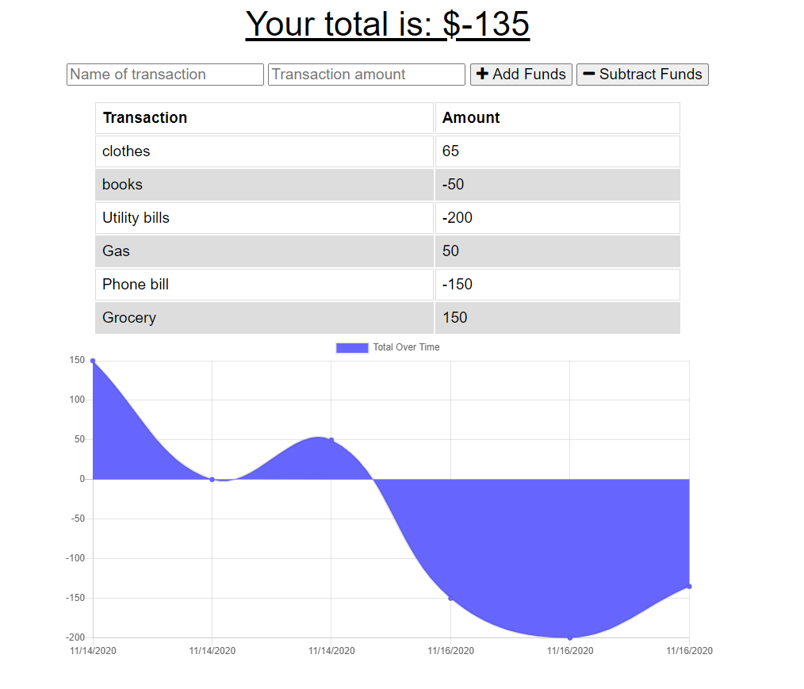

# Budget-Tracker

[Deployed App in Heroku](https://intense-reaches-74177.herokuapp.com/)

## Table of contents
- [Description](#description)
- [Installation](#installation)
- [Demo](#demo)
- [License](#license)
- [Technologies Used](#technologies-used)
- [Questions](#questions)




## Description

This is a Progressive Web Application that enables users to add expenses and deposits to their budget while online/offline. When entering transaction offline data store in the indexedDB pending, waiting to be saved in MongoDB database when connected back online.

## Installation

1. Clone the Repository

Open your Bash/Terminal an type the following command:
```
git clone git@github.com:ayshasanyang/Budget-Tracker.git
```
2. Open the project folder in Visual Studio Code can be found [here](https://code.visualstudio.com/download) and type the following command to install the dependencies.
```
npm install
```

3. In you terminal run the following command to start the application type localhost:3000 in your browser:

```
 node server.js
```

## Demo


## License
[](https://opensource.org/licenses/MIT)


## Technologies Used

- HTML5
- CSS
- Node.js
- Express
- MongoDB
- MongoDB Atlas
- IndexedDB
- Heroku

## Questions
For any other questions, please send me an email at: isasanyang1986@yahoo.co.uk